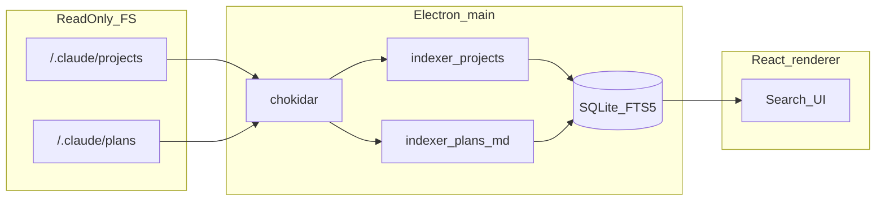

# Architecture

## High-level flow



## Processes

- **Main**: filesystem access, SQLite (`better-sqlite3`), indexing, `chokidar`, IPC handlers, clipboard.
- **Preload**: exposes a narrow `window.vault` API via `contextBridge`.
- **Renderer**: React + Tailwind + Fuse.js for optional client-side re-ranking of the current result set.

Security defaults: `contextIsolation: true`, `nodeIntegration: false`.

## Paths

- **Claude home**: default `~/.claude` (i.e. `path.join($HOME, '.claude')`). Override the parent directory with an **absolute** `CLAUDE_HOME` so both `projects` and `plans` resolve under that folder (`CLAUDE_HOME/projects`, `CLAUDE_HOME/plans`). Intended for tests or non-default installs.
- **Plans (read-only)**: `~/.claude/plans/**/*.md` up to a fixed directory depth (8) is indexed into `plan_files` + `plan_files_fts`. The app does **not** read bundled repo snapshots (e.g. `asstes/`) as a runtime source; keep such trees out of git with `.gitignore` if they are dev-only.
- **Claude data (read-only)**: under `~/.claude/projects/{slug}/` we index **all `*.jsonl` up to a shallow depth** (typically 8), because Claude Code stores sessions in more than one place:
  - **Legacy / Cursor-style:** `agent-transcripts/*.jsonl`
  - **Common:** `{uuid}.jsonl` at the project cache root
  - **Nested:** `{uuid}/subagents/*.jsonl` and similar
  - **Index hints:** `sessions-index.json` lists `fullPath` / `originalPath`; we merge existing files from `entries[].fullPath` and use `originalPath` as the **display title** in the UI when available.
- **App database**: `app.getPath('userData')/vault.db` (e.g. macOS `~/Library/Application Support/claude-vault/vault.db` — exact folder follows Electron `productName` / `name`).

## JSONL parsing

Each non-empty line is JSON. Expected shape (observed):

```json
{ "role": "user" | "assistant", "message": { "content": [{ "type": "text", "text": "..." }] } }
```

The parser in `shared/jsonlParse.ts` also tolerates:

- `content` as a plain string.
- Array items with types such as `tool_use` (serialized into text for indexing).
- Invalid JSON lines (indexed with minimal metadata where possible).

It additionally lifts **line-level metadata** into `ParsedLine`: `tsMs` (from ISO `timestamp`), `model` and token `usage` (from `message.model` / `message.usage` on assistant lines), and `isSidechain`. These feed the schema-v4 `messages` columns and the usage analytics in the Stats tab. `parseTimestampMs` and `extractUsage` are exported and unit-tested.

### Content kinds (PoC / runtime)

Run `npm run poc` to print aggregated `contentKinds` from your machine. Extend the table below as new kinds appear.

| Kind | Handling |
|------|-----------|
| `last-prompt` | Use `lastPrompt` string (Claude Code echo of latest user message) |
| `text` | Concatenate `text` fields |
| `tool_use` | `[tool_use:name] + JSON.stringify(input)` |
| `string` | Top-level string content |
| `invalid_json` | Store raw preview only |

## SQLite schema (summary)

- `projects` — one row per Claude project folder (slug).
- `sessions` — one row per `*.jsonl` file; `file_mtime_ms` drives incremental re-index.
- `messages` — one row per parsed JSONL line with text body and `message_class` (`dialog` \| `meta` \| `other`) for filtering noisy system lines (permission mode, titles, etc.). **Schema v4** adds per-line metadata: `ts_ms` (epoch ms from the line `timestamp`), `model`, token usage (`input_tokens`, `output_tokens`, `cache_read_tokens`, `cache_creation_tokens`), and `is_sidechain`. Upgrading from an older DB clears `sessions` once so a full reindex repopulates these columns (mtime-skip would otherwise leave them NULL).
- `messages_fts` — FTS5 external content table on `messages.body` with triggers for insert/update/delete.
- `plan_files` — one row per plan Markdown file under the plans root; `file_mtime_ms` drives incremental re-index; `title` from first `#` heading or filename.
- `plan_files_fts` — FTS5 external content on `plan_files` (`title`, `body`) with the same trigger pattern as `messages_fts`.
- `favorites` — `message_id` + timestamp.
- `tags`, `message_tags` — many-to-many tagging.
- `templates` — reusable prompt bodies with `{{variable}}` placeholders (name/body/timestamps).
- `projects.tool` — source tool id (`claude` \| `codex` \| …) set by the indexing adapter.
- `file_refs` — reverse index of file paths mentioned in tool payloads (`message_id` + `path` + `basename`), powering the Files tab.
- `model_prices` — user-editable USD price list, per million tokens (`input`/`output`/`cache_read`/`cache_write`). Seeded once from the dated defaults in `shared/pricing.ts`; user edits always win and are never re-seeded. **Deliberately not tied to `SCHEMA_VERSION`** — it stores no parsed transcript data, so adding it needs no reindex.

## Cost estimation

`shared/pricing.ts` turns the token columns already captured on `messages` into a USD estimate. Two rules keep it honest:

- **Prices are seeded, not baked in.** `DEFAULT_PRICES` is dated by `PRICES_AS_OF` and shown in the editor; the `model_prices` row always overrides it. Published rates change, and a silently stale constant is worse than a visibly editable table.
- **Unpriced models are excluded, not zeroed.** `costOf()` returns `null` when no price row matches, and the UI reports the count separately — a `$0` line would read as "this was free". Models with zero recorded tokens (Claude Code's `<synthetic>` placeholder) are dropped before that count is taken.

Model ids are matched by **longest prefix**, so the dated ids in transcripts (`claude-haiku-4-5-20251001`) resolve to their base entry, and a specific override always beats a broader one regardless of row order.

## Localization

`shared/i18n.ts` holds a typed dictionary; `ko` is the source of truth and `Messages` is derived from it, so a key added to `ko` and missing from `en` is a **type error**, not a runtime blank. `src/i18n.tsx` provides `I18nProvider` / `useI18n` / `useT`, persists the choice to `localStorage` (`vault-locale`), and falls back to the browser language. Dates and numbers go through `BCP47[locale]` rather than the OS default.

Two things stay outside the dictionary on purpose:

- **Main-process dialogs** can fire before any window exists, so they cannot read the renderer's locale; they use `app.getLocale()` and a small inline string table.
- **Operational labels written by the parser** (`[도구]`, `[대기열] dequeue`, …) are stored *in the DB*, so translating them would require a full reindex on every language switch. They are left stable.

## Tool adapters

`electron/adapters.ts` defines a `ToolAdapter` (id, label, root, `isAvailable`, `listProjects`, `listSessions`). `getAvailableAdapters()` returns every adapter whose data dir exists — currently the **Claude Code** adapter (`~/.claude/projects`) and a best-effort **Codex CLI** adapter (`~/.codex/sessions`, namespaced slugs, inert when absent). The indexer (`indexAdapterProject`) tags each project with the adapter id and parses sessions with the shared JSONL parser. Non-Claude adapters currently index on startup / manual reindex (the live watcher covers the Claude + plans roots).

## Search

- Primary: SQLite FTS5. `buildFtsQuery(raw, matchMode)` supports `any` (OR prefix tokens), `all` (AND prefix tokens), and `phrase` (whole query as one exact phrase); `"quoted groups"` are always exact phrases. `sort` (`relevance` \| `newest` \| `oldest`) and a `sinceMs`/`untilMs` range filter operate on `messages.ts_ms` (plan hits use `file_mtime_ms`). Hits carry `tsMs` for display and cross-scope time interleaving.
- On FTS syntax errors or engine issues, fallback: SQL `LIKE` on `messages.body`.
- **Plans**: separate FTS on `plan_files_fts`; `SearchFilters.scope` is `messages` \| `plans` \| `all`. Unified results use a discriminated union (`hitType: 'message' \| 'plan'`). Full plan bodies are loaded on demand via `planBody(planId)` to avoid huge payloads in the hit list.
- **`scope: 'all'` ordering**: message and plan hits use **different FTS5 BM25 scales**, so results are **not interleaved by a single score**. The app returns **all message hits (sorted by message rank)** then **all plan hits (sorted by plan rank)** for stable, explainable sections.
- **Empty query** returns no rows from the search API; the UI shows **recent sessions** and/or **recent plans** depending on the selected source (`recentSessions`, `plansList` IPC). `recentSessions(projectId?)` limits rows to one project when the sidebar filter is set.
- Optional filters: `excludeMeta` (default on), `excludeSubagents` (path contains `subagents`).
- Renderer may apply Fuse.js on the current hit list for fuzzy reordering (does not replace FTS).

## IPC contract

See `shared/ipc.ts` for channel names and DTOs. Main implements handlers; preload exposes `window.vault.*`. Untrusted renderer input is normalized in [`electron/ipcGuards.ts`](electron/ipcGuards.ts) (search limits, positive integer IDs, export batch cap).

- **`sessionTranscript(sessionId)`** — returns all indexed rows for one `sessions` row (one JSONL file), `ORDER BY line_index`, for the full-thread UI (max 25,000 lines). The renderer lays out `user` / `assistant` as chat-style bubbles (right / left), sized to content up to a max width so they do not span the full modal; only `message_class === 'meta'` rows use a centered, full-width strip.

## Incremental indexing

- Full scan on startup: walk projects, index each JSONL whose `mtime` changed vs `sessions.file_mtime_ms`; walk plans root and upsert each `*.md` vs `plan_files.file_mtime_ms`. After indexing, `pruneMissingProjectsAndSessions` deletes rows whose backing file/dir is gone (messages + FTS cascade).
- Live updates: `chokidar` **v4 removed glob support**, so the watcher subscribes to the two **root directories** (`~/.claude/projects`, `~/.claude/plans`) recursively and filters by extension in the dispatch handler (`node_modules` / `.git` / `__pycache__` subtrees are ignored). JSONL paths go through `indexSinglePath`; Markdown under the plans root goes through `indexPlanSinglePath`. `unlink` on a plan file removes its `plan_files` row.

## Packaging

- `electron-builder` produces macOS DMG. Native module `better-sqlite3` is unpacked from asar (`asarUnpack: **/*.node`).
